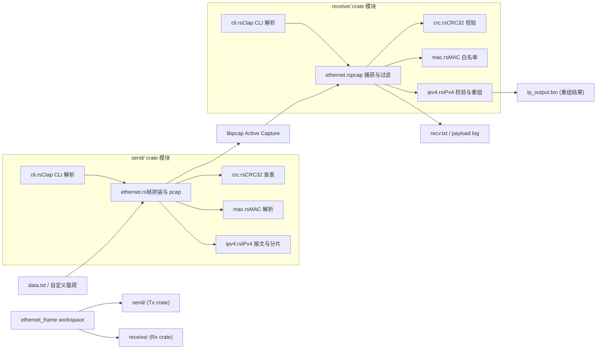
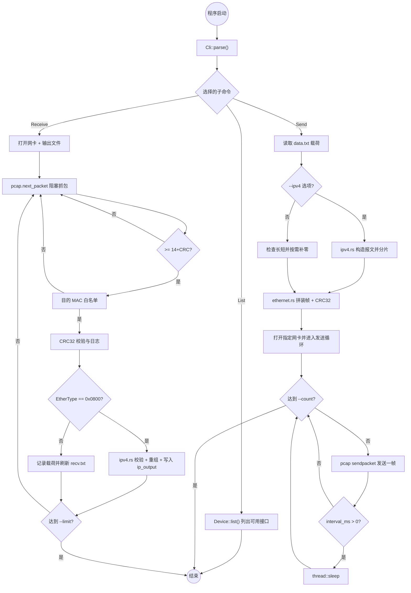

# 2025-11-30 Changelog

## Commit 2105b6f564d9e15371d003467db19d943bda4d9b
- 拆分原单体 `src/main.rs`，建立 `send/` 与 `receive/` 两个独立二进制入口，并创建对应的 `Cargo.toml`。
- 新增发送端模块化结构（`cli.rs/crc.rs/ethernet.rs/ipv4.rs/mac.rs`），实现 CLI、CRC32、IPv4 分片构造与帧发送管线。
- 新增接收端模块化结构（`cli.rs/crc.rs/ethernet.rs/ipv4.rs/mac.rs`），为后续 IPv4 校验与分片重组打下基础。
- 更新 `recv.txt`，提供示例抓包输出。

## 后续工作（基于最近的协作需求）
- **IPv4 发送增强**：`ethernet_frame_send` 增加 `--ipv4` 相关选项，支持指定源/目的 IP、TTL、TOS、协议号、分片大小、DF 标志及报文 ID；在发送循环中轮播所有分片，对应接收端重组逻辑。
- **接收端 UTF-8 适配**：`receive/src/ethernet.rs` 在打印帧内容时先识别 IPv4，有效地跳过 IP 头再尝试 UTF-8 解码，不可解码时回退到 ASCII/十六进制转储。
- **分片重组日志**：`receive/src/ipv4.rs` 在无分片或重组完成后，都会再次输出完整的 IP 负载（优先 UTF-8），方便对照 `ip_output` 文件内容。
- **使用文档**：新增 `README.md`，覆盖开发/Release 构建流程、send/receive 命令示例及 IPv4 新功能说明。

## Mermaid 架构与流程图

### 整体架构图

### 运行流程图

