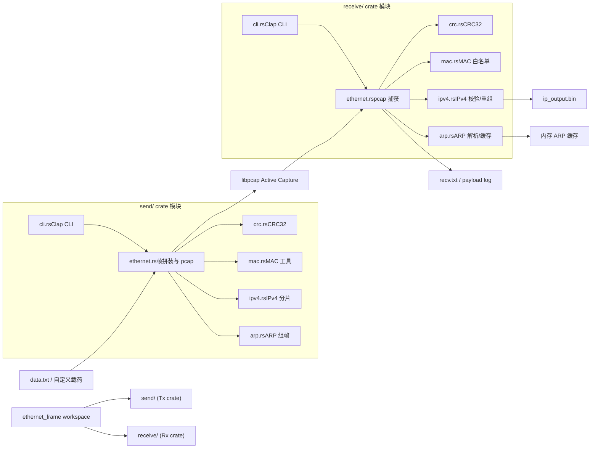
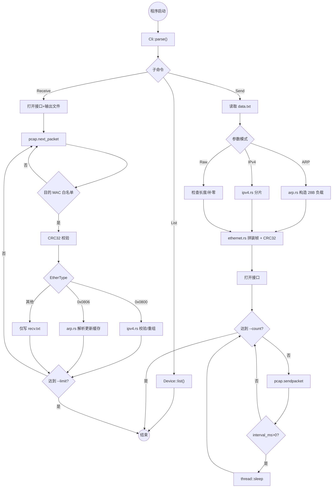

# 2025-12-06 Changelog

## 新增 ARP 发送能力
- `send/src/arp.rs` 新增 RFC 826 组帧逻辑，提供 `ArpOperation` 枚举与 `build_arp_payload` 帮助函数。
- CLI 增加 `--arp-mode`（Request/Reply）、`--arp-target-ip`、`--arp-target-mac` 选项，可直接从命令行构造 ARP 帧。
- `ethernet.rs` 根据模式自动选择 EtherType=0x0806，并对 ARP 载荷执行最小以太网长度填充，保持与 IPv4/原始载荷路径互斥。
- `mac.rs` 暴露 `from_raw` 与 `broadcast` 构造函数，便于在 ARP 场景中快速配置源/目的地址。

## 接收端 ARP 支持
- `receive/src/arp.rs` 新增解析与缓存组件，检测 EtherType=0x0806 时输出操作码、MAC/IP 等关键字段，并维护内存中的 ARP 表。
- `receive/src/ethernet.rs` 在抓包主循环中串联 `ArpProcessor`，并复用 IPv4 白名单(`--accept-ip`) 判定是否需要处理当前 ARP 报文。
- `ipv4.rs` 暴露 `allowed_slice`，方便 ARP 与 IPv4 共用相同的目标 IP 配置，保持与 C++ 版逻辑的一致性。
- `README.md` 更新，说明 ARP 报文在 send/receive 两侧的使用方式与调试要点。

## Mermaid 架构与流程图（ARP 版）

### 整体架构图

### 运行流程图

