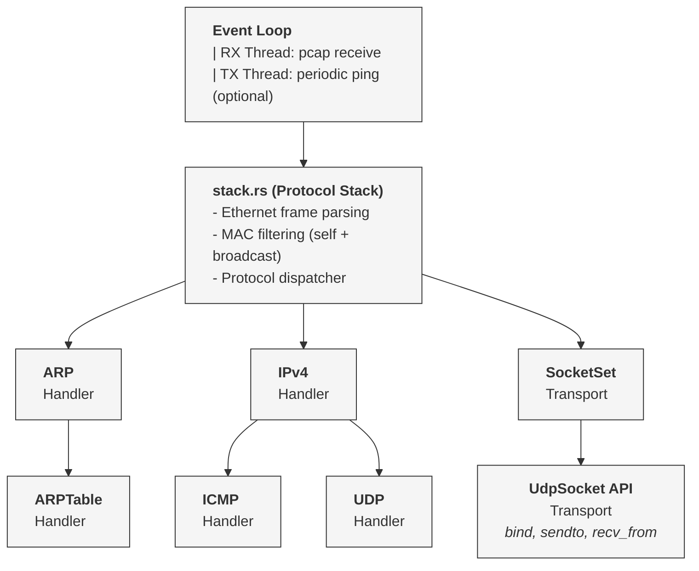
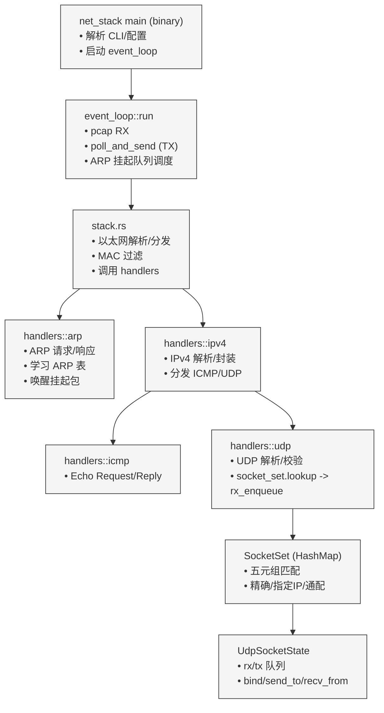

# 2025-12-13 Changelog - UDP 传输层与示例

## Added
- **UDP 传输层可用**：引入 `UdpSocketState`（收发队列）+ `UdpSocket` Wrapper，提供 `bind / send_to / recv_from` API，使用五元组 `SocketHandle` 与 `SocketSet` 的多级匹配（精确/指定 IP/通配）。
- **示例应用**：新增 `udp_server` 与 `udp_client` 两个二进制目标（Echo Server/Client），支持从 CLI 直接运行，示范 Socket API 与后台事件循环协同工作。
- **库入口**：`net_stack/src/lib.rs` 暴露核心模块，支持以库形式被示例和外部代码引用。
- **ARP 自动解析链路**：事件循环中在发送路径发起 ARP 请求，并在收到 ARP 响应后批量发送挂起数据包。

## Changed
- **Cargo 配置**：`net_stack/Cargo.toml` 增加 `[[bin]]` 目标，方便 `cargo run --bin udp_server` / `udp_client` 直接启动。
- **README 文档**：补充 UDP 示例的运行方式、前置条件与测试流程。

## Fixed
- 修复 IPv4 调用链中对 `stack` 的句柄传递错误，确保分发器调用正确的处理函数。

## Notes
- 当前 UDP 功能为基础版本（无重传、无端口不可达 ICMP 回复），但已支持基础的收发和 Echo 验证。
- ARP 表已具备自动学习与发送挂起包的能力，但持久化与老化策略后续再完善。

## Architecture (2025-12-13)
架构图

流程图

